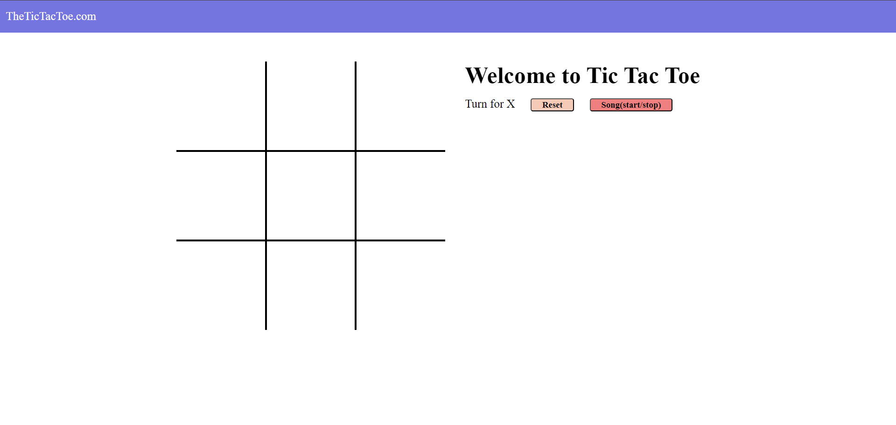

# Tic Tac Toe



## Overview

Welcome to the Tic Tac Toe project! This classic game is implemented in HTML, CSS, and JavaScript, providing a simple and interactive way to play Tic Tac Toe against another player.

## Preview


[Play Tic Tac Toe](https://chetankumar9903.github.io/Tic-Tac-Toe-Game/)

## Features

- Two-player gameplay
- Interactive and responsive user interface
- Basic win/draw logic
- Simple and clean design

## Getting Started

1. Clone the repository:

    ```bash
    git clone https://github.com/your-username/tic-tac-toe.git
    ```

2. Open `index.html` in your web browser.

## Playing the Game

Visit [the live website](https://chetankumar9903.github.io/Tic-Tac-Toe-Game/) to play Tic Tac Toe.

- Click on a grid cell to make your move.
- The game will automatically switch between X and O players.
- The game announces the winner or a draw when the game is over.

## Contributing

If you'd like to contribute to this project, feel free to fork the repository and submit a pull request.


---

Enjoy playing Tic Tac Toe!
